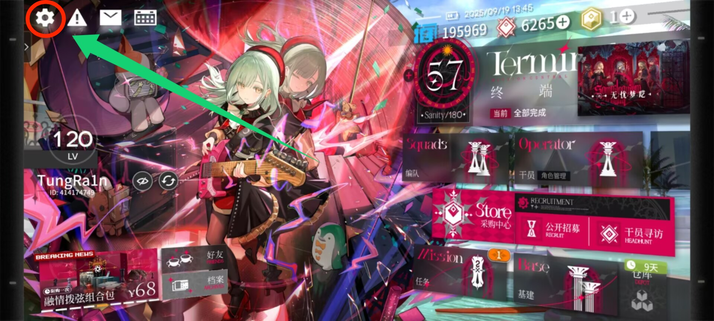
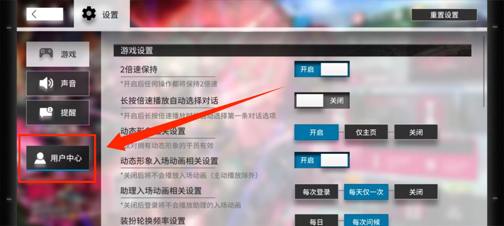
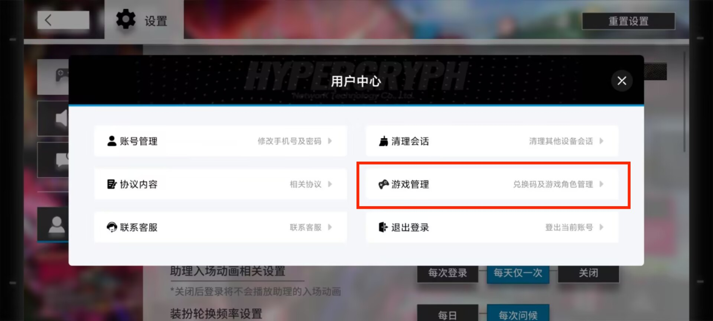
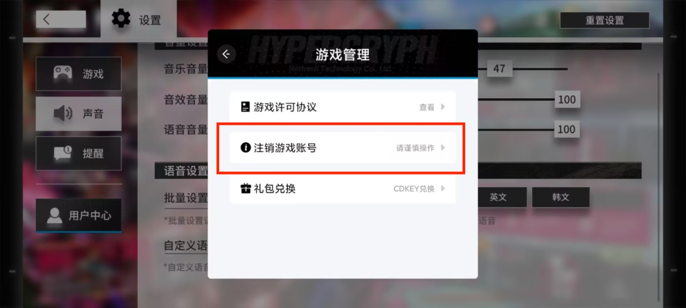
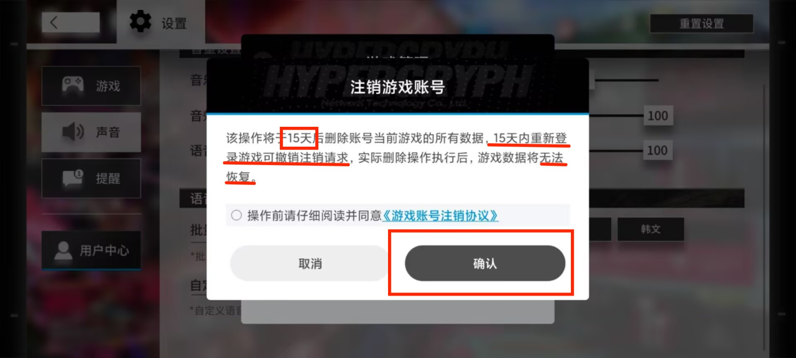
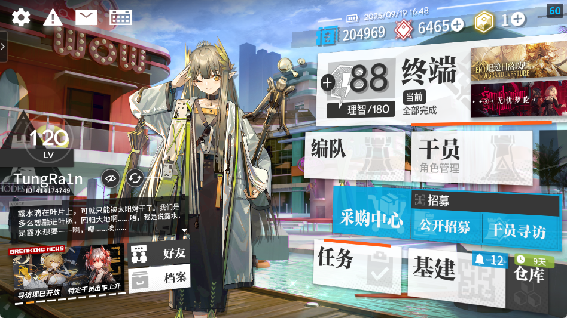

## 最速退坑方案

- 萌新不熟悉ui？不要紧！一步一步跟着我做，别给自己的人生留下遗憾！

1. 主页面

2. 设置页面

3. 用户中心

4. 游戏管理

5. 注销账号

- **至此，只要能忍住15天不上号，就可以完全脱离明日方舟苦海，跟海猫络合物彻底说拜拜**

<h style="font-size:1.5em"> **如果说你没忍住** or **决定要继续玩下去**...那么</h>

-----------------

<b>
...欢迎来到 明日方舟 的<ruby><rb data-id="template-ruby">世界</rb><rt style="font-size:0.5em">泰拉</rt></ruby>
</b>

> 施工中.....  
> 以下攻略仅为ldx带xdx的个人思路，纯主观desuwa
> 推荐关注明日方舟官方账号，站在吃饼第一线 / 收藏prts.wiki，站在拉表第一线

## 一、了解UI界面

- 这里我就不给大家介绍ui界面了,可以到处点点看一下(特别是那些个红点点你不把它点掉不难受吗😡)

> 一个正常萌新的主页应该是这样的

## 二、干员获取方式

- 在明日方舟中，干员获取方式大概可分为三种
  1. 干员寻访
     - 就是俗称的“抽卡”，通过消耗合成玉招募干员
     - 池子也可以分为三种，三种池子概率分别计算(抽卡次数分别累计)
        > 对于60抽加概率等保底\吃井机制建议自行搜索
        1. 限定池
            - 包含限定干员的池子，一般在周年、半周年、夏活、春节等大型活动推出(联动池抽数不累计)
        2. 常驻池
            - 新的非限定干员会加入这个池子，进行轮换up(还有进店什么的可以自己去看看)
        3. 中坚池
            - 这个池子实际上是因为干员太多了，分一部分老人出来组成的池子，跟常驻池机制差不多
  2. 公开招募
  - 选时间、选tag、点开始，这个可以参考[PRTS公招计算器](https://prts.wiki/w/%E5%85%AC%E6%8B%9B%E8%AE%A1%E7%AE%97)
  3. 活动赠送
  - 就是活动会赠送干员，有些还挺强的

> 卡池机制什么的可以看看这篇文章(无引流，刚好看到，我没看完)  
> <a href="https://www.xiaoheihe.cn/app/bbs/link/6d0570e5e0b0" target="_blank">[小黑盒]给Ave Mujica入坑的新博士讲解一下明日方舟卡池规则和后续规划</a>

> 关于一些俗语缩写  
> 像是gxyy、174、52、42、粉毛、小猪、大姨、小姨、红蒂蓝蒂等等等...  
> ~~太棒了学会这些你就可以做云玩家拉~~

## 三、关卡内容

- 明日方舟是一款塔防游戏

