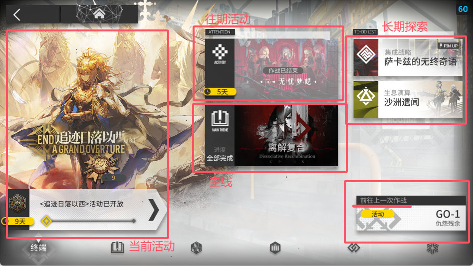
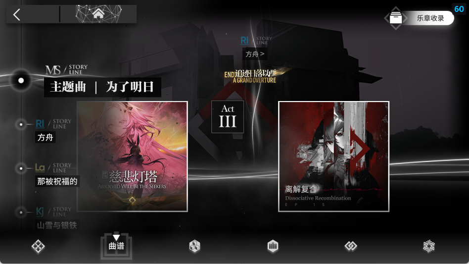
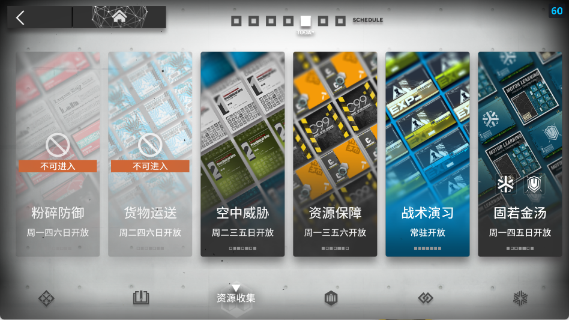
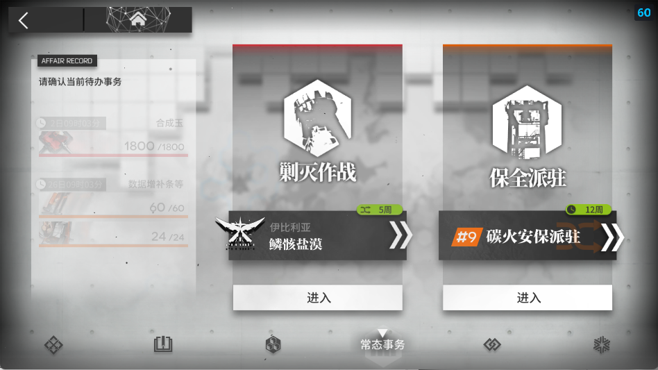
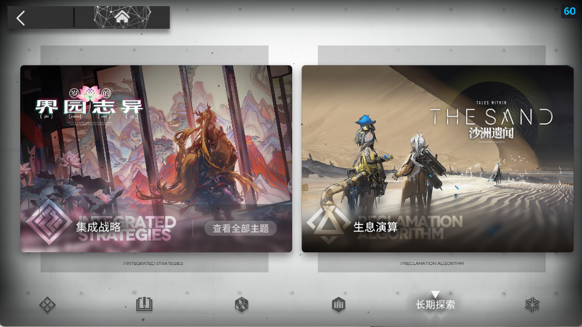
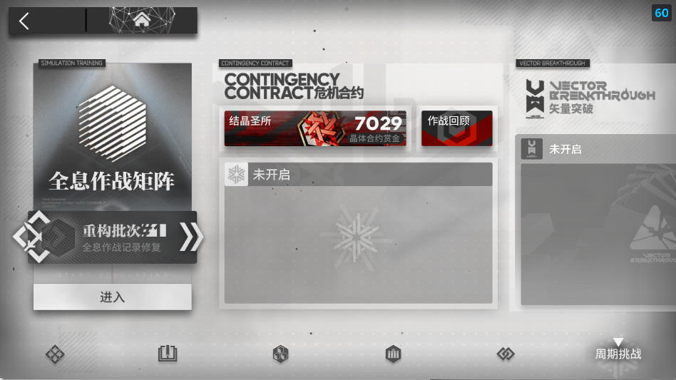

## 最速退坑方案

- 萌新不熟悉ui？不要紧！一步一步跟着我做，别给自己的人生留下遗憾！

1. 主页面

2. 设置页面

3. 用户中心

4. 游戏管理

5. 注销账号

- **至此，只要能忍住15天不上号，就可以完全脱离明日方舟苦海，跟海猫络合物彻底说拜拜**

<h style="font-size:1.5em"> **如果说你没忍住** or **决定要继续玩下去**...那么</h>

-----------------

<b>
...欢迎来到 明日方舟 的<ruby><rb data-id="template-ruby">世界</rb><rt style="font-size:0.5em">泰拉</rt></ruby>
</b>

> 施工中.....  
> 以下攻略仅为ldx带xdx的个人思路，纯主观desuwa  
> 一些看不懂的术语我们没有解释清楚的可以优先百度查找，再或者找老登问问
> 推荐关注明日方舟官方账号，站在吃饼第一线 / 收藏[prts.wiki](https://prts.wiki/)，站在拉表第一线

## 一、了解UI界面

- 这里我就不给大家介绍ui界面了,可以到处点点看一下(特别是那些个红点点你不把它点掉不难受吗😡)

> 一个正常萌新的主页应该是这样的

## 二、干员获取方式

- 在明日方舟中，干员获取方式大概可分为三种
  1. 干员寻访
     - 就是俗称的“抽卡”，通过消耗合成玉招募干员
     - 池子也可以分为三种，三种池子概率分别计算(抽卡次数分别累计)
        > 对于50抽加概率等保底\吃井机制建议自行搜索
        1. 限定池
            - 包含限定干员的池子，一般在周年、半周年、夏活、春节等大型活动推出(联动池抽数不累计)
            > 联动卡池一般保底为120抽必得  
            > 120抽前抽到则无法享受120抽保底  
        1. 常驻池
            - 新的非限定干员会加入这个池子，进行轮换up(还有进店什么的可以自己去看看)
        2. 中坚池
            - 这个池子实际上是因为干员太多了，分一部分老人出来组成的池子，跟常驻池机制差不多
  1. 公开招募
  - 选时间、选tag、点开始，这个可以参考[PRTS公招计算器](https://prts.wiki/w/%E5%85%AC%E6%8B%9B%E8%AE%A1%E7%AE%97)
  1. 活动赠送
  - 就是活动会赠送干员，有些还挺强的

> 卡池机制什么的可以看看这篇文章(无引流，刚好看到，我没看完)  
> <a href="https://www.xiaoheihe.cn/app/bbs/link/6d0570e5e0b0" target="_blank">[小黑盒]给Ave Mujica入坑的新博士讲解一下明日方舟卡池规则和后续规划</a>  

> 关于一些俗语缩写  
> 像是gxyy、174、52、42、粉毛、小猪、大姨、小姨、红蒂蓝蒂等等等...  
> ~~太棒了学会这些你就可以做云玩家拉~~

## 三、关卡内容

- 明日方舟是一款塔防游戏，但是内容还挺多的 ~~(高级版保卫萝卜)~~
- 转跳 [PRTS-关卡一览](https://prts.wiki/id/2325)
- 在终端页面里都有这些：
    1. 主页
        > 部分内容的汇总
        > 
    2. 曲谱
        > 主线和往期活动
        > 
    3. 资源收集
        > 龙门币、红票、技能书(技巧概要)、经验书(作战记录)、精英材料(芯片、芯片组)等资源的关卡  
        > 各个关卡是轮流开放的，一些活动期间会全部开放
        > 
    4. 常态事务
        > 包括[剿灭作战](https://prts.wiki/id/41204)和[保全派驻](https://prts.wiki/id/41642)  
        > 分别可以获取合成玉和模组材料
        > 
    5. 长期探索
        > 包括[集成战略(肉鸽)](https://prts.wiki/id/20416)和[生息演算](https://prts.wiki/id/49253)  
        > 这是两个可玩性很高，内容很多的模式，肉鸽甚至还有比赛
        > 
    6. 周期挑战
        > 这里面是一些难度比较高，挑战性比较大的内容，现在有[全息作战矩阵](https://prts.wiki/id/82590)、[矢量突破](https://prts.wiki/id/78213)和大名鼎鼎的[危机合约](https://prts.wiki/id/13706)  
        > 其中全息作战矩阵需要通关主线关卡H5-1或H9-1或H15-1后解锁
        > 

- 除此之外，还有一些愚人节活动、[争锋频道](https://prts.wiki/id/82364)等有趣的活动。

## 四、干货内容

- 首先，关于抽卡练卡，肯定是xp优先，新时代的各位干员日常清图无压力；其次，阿米娅是底层代码，主线有强制的练度要求；然后就是强度，维、逻等超大杯干员。

- 在新手福利提高后，新手能领到以下道具，可以帮助新手快速度过前期

 1. 资深干员调用凭证（2021）推荐华法琳(ff0)或者直接xp
 2. 高级干员调用凭证-新人 
    1. 塞雷娅：地面奶盾，一个强大的抗伤+回血干员，适合放在前排。
    2. 棘刺：领主，地面后排输出，在精英二阶段(精二)解锁三技能至高之术前不强。
    3. 能天使：高台位速狙，不强，可用寒芒克洛斯代替
    4. 银灰：棘刺同模板，一二在前期也可用一技能偏攻击、二技能偏生存，三技能属于决战技(现版本伤害不够，带上场主要是天赋减再部署时间和反隐)
    5. 煌：地面输出干员，一般使用二技能挂机
    6. 山：地面输出+抗伤，二技能切换模式，有自回血，可挂机
 3. 资深干员特训邀请函(五星精二券) 
    - 可以让你的五星干员直接升到精英二阶段
 4. 资深干员特训装置(五星满级券) 
    - 可以让你的精二五星干员直接升到满级

- 虽然已经过了一年，但还是可以参考zc的视频(他的低配作业还有相声可以听:>)

<iframe width="100%" height="468" src="//player.bilibili.com/player.html?bvid=BV1rH4y1c71x&p=1&autoplay=0" scrolling="no" border="0" frameborder="no" framespacing="0" allowfullscreen="true" &autoplay=0> </iframe>

- 虽然现在已经不再是那个24年的夏天，我们也从东国的夏日闹剧中抽离，离开了Ave Mujica的世界...但当期活动收益仍是最高的。无论你什么时候看见这篇文章，都十分推荐优先打活动关卡。

### 乌尔饼干嘎嘣脆#6127的传奇开荒路

- 肉鸽
>
> 施工中............

<!--  -->
